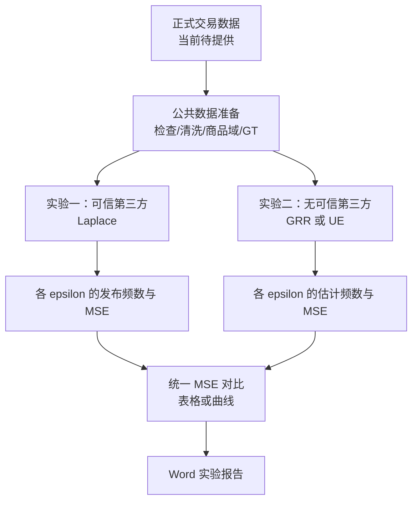

# 大数据隐私保护实验项目总导航

> 文档定位：[建议方案] 本文件是后续代码开发、实验执行、结果审计与报告撰写的统一导航，不是实验结果，也不替代《实验作业.pdf》。
>
> 权威顺序：[硬性要求] 《实验作业.pdf》是唯一权威的硬性要求来源；[框架理解] 《大实验.md》仅是前期整理，可能有误。用户需求中数次写作“《大实验.pdf》”，但项目内实际文件名为《大实验.md》，本文件按实际文件处理。
>
> 当前状态：[待确认] 尚未发现正式交易数据文件；本阶段未编写实验代码、未安装依赖、未生成数据或结果。

## 0. 信息标记规则

- [硬性要求] 原始《实验作业.pdf》明确规定的内容。
- [框架理解] 来自《大实验.md》的整理或理解。
- [建议方案] 根据实验规范提出、但原始 PDF 未强制规定的方案。
- [待确认] 原文没有明确规定，或存在多种合理口径，必须由用户决定。
- [错误修正] 《大实验.md》中存在的概念或逻辑错误及其修正。
- [建议方案] 若同一条目同时含不同来源，将在句内或表格单元格中分别标注，不以章节标题代替逐项标记。
- [硬性要求] 两个文件冲突时，以《实验作业.pdf》为准；[建议方案] 冲突必须显式记录于“冲突、错误与修正”，不得静默覆盖。

## 1. 项目一句话定义

[硬性要求] 输入为“每行对应一名用户、由数量不等的多个商品 item 构成”的购买 transaction 数据；要保护个人购买信息；分别在“存在可信第三方”的集中式差分隐私场景与“无可信第三方”的本地差分隐私场景中发布 item 频数估计，并以四个隐私预算下的均方误差 MSE 评价数据精度。（来源：《实验作业.pdf》第 1 页“一、数据集描述”“三、实际应用场景”，第 2 页“四、评估指标”）

## 2. 原始任务的输入、查询和输出

### 2.1 数据单位与变量

| 项目 | 定义 |
|---|---|
| 一行 | [硬性要求] 对应一名用户的一条购买记录（transaction），由多个以空格切分的 item 构成。（PDF 第 1 页“一、数据集描述”） |
| 为什么不等长 | [硬性要求] 不同用户购买的商品数量可以不同，所以每个用户的 transaction 长度可能不同。（PDF 第 1 页“一、数据集描述”） |
| item | [硬性要求] 商品；PDF 示例用数字表示商品。（PDF 第 1 页“一、数据集描述”） |
| transaction | [硬性要求] 一位用户一行购买的商品所形成的购买信息。（PDF 第 1 页“一、数据集描述”） |
| 用户购物篮 | [框架理解] 本导航将“一位用户的 transaction”简称为该用户的购物篮；它不是 PDF 新增的另一种数据结构。 |
| \(n\) | [建议方案] 纳入统计的有效用户/transaction 行数；PDF 未显式引入符号 \(n\)，但第 13 页 GRR 参考材料使用 \(n\) 表示用户数。正式数据清洗后如何计入空行仍待 D5 确认。 |
| \(d\) | [硬性要求] item 总数，即频数向量维度。（PDF 第 2 页“四、评估指标”；第 13 页参考材料用域 \(D=\{1,\ldots,d\}\)） |
| \(f_i\) | [硬性要求] item \(i\) 的精确频数。（PDF 第 2 页 MSE 公式说明） |
| \(\hat f_i\) | [硬性要求] item \(i\) 发布的带噪频数/估计频数。（PDF 第 2 页 MSE 公式说明；原 PDF 公式排版以 \(f_i^*\) 表示发布值，本导航统一记为 \(\hat f_i\)） |
| GT | [建议方案] Ground Truth，即与某个明确统计目标对应的真实频数向量 \(\mathbf f=(f_1,\ldots,f_d)\)；GT 必须直接从相应未扰动数据计数得到，不能由敏感度计算。 |

### 2.2 查询与真实频数

- [硬性要求] 原始查询是发布所有 item 的频数分布，即 item1 至 itemd 分别被多少人次购买。（PDF 第 1 页“二、发布或查询的问题”）
- [硬性要求] PDF 示例两行 `1 2 4 8 9` 与 `4 9 10` 对应发布向量 `(1,1,0,2,0,0,0,1,2,1)`。（PDF 第 1 页）
- [建议方案] 若“频数”按“多少用户购买”理解，则在一行内去重后，完整购物篮 GT 可写为
  \[
  f_i=\sum_{u=1}^{n}\mathbf 1[i\in T_u],\qquad i=1,\ldots,d,
  \]
  其中 \(T_u\) 是用户 \(u\) 的购物篮集合；但重复 item 的实际处理必须由 D4 确认，因为 PDF 没有给出含重复 item 的示例。
- [待确认] 如果选择单商品统一目标，则先得到每用户的单商品输入 \(x_u\)，再计算 \(f_i=\sum_u\mathbf 1[x_u=i]\)。这与完整购物篮 GT 是不同 estimand，不能混称同一个 GT；由 D1 决定。
- [硬性要求] 最终发布结果是所有 item 的带噪/估计频数向量，并计算不同场景、不同 \(\varepsilon\) 下的 MSE。（PDF 第 1 页“二”，第 2 页“三、四、五”）
- [待确认] 两个已读文件均未提供正式数据文件、正式文件名、编码、分隔符规范、商品域元数据或 header 规则；不得假设某个数据文件已经存在。

## 3. 整体实验框架

- [框架理解] 公共数据准备阶段：读取正式交易数据，检查结构，建立商品域并构造与选定统计目标一致的真实频数 GT。
- [硬性要求] 实验一：可信第三方下使用 Laplace 机制扰动最终频数估计。（PDF 第 1 页“三、①”）
- [硬性要求] 实验二：无可信第三方下使用 randomized response 或 UE 机制对每名用户数据进行本地扰动；PDF 提示多 item 用户可随机采一个 item。（PDF 第 2 页“三、②”）
- [硬性要求] 统一 MSE 对比阶段：在 \(\varepsilon\in\{0.1,1,2,4\}\) 下比较两种背景的数据精度，以曲线图或表展示。（PDF 第 2 页“四、五”）
- [硬性要求] 实验报告整理阶段：包含敏感度分析、两种场景的四步式方案、实验结果对比以及粘贴到 Word 的代码，并按规定命名和发送。（PDF 第 2 页“五”）
- [建议方案] 公共阶段的数据清洗规则与商品域映射应由两个实验共享；两个实验应共享哪个 GT 取决于 D1。
- [建议方案] 实验一和实验二是从公共数据准备阶段分出的并行机制分支；正常情况下，一个实验的带噪输出不作为另一个实验的输入。
- [硬性要求] 两分支最终汇总的是四个 \(\varepsilon\) 下的 MSE，并形成表格或曲线。（PDF 第 2 页“五、③”）

[建议方案] 图中的并行关系不代表两场景一定拥有可直接比较的相同 GT；是否统一统计目标由 D1 决定。

## 4. 各阶段实验卡片

### 4.1 公共数据准备阶段

| 字段 | 内容 |
|---|---|
| 目的 | [框架理解] 把正式交易记录转为可审计的数据结构、商品域和真实频数 GT。 |
| 输入 | [硬性要求] 每行一名用户、多个 item、行长可不同的 transaction。（PDF 第 1 页“一”）[待确认] 正式文件尚不存在或尚未提供。 |
| 处理过程 | [建议方案] 只在 D1、D4、D5、D6 确认后定义解析、重复项、空篮、商品域映射和（如适用）固定抽样规则。 |
| 必须分析的问题 | [硬性要求] item 总数 \(d\)。（PDF 第 2 页“四”）[框架理解] 用户数、每用户商品数分布。[待确认] 非连续编号、重复项、空篮。 |
| 要实现的实验 | [框架理解] 数据读取与真实频数统计；本阶段尚不实现。 |
| 要验证的内容 | [建议方案] 行数、解析失败数、域映射可逆性、GT 维度、GT 范围及手算小样例一致性。 |
| 理论预期 | [建议方案] 在去重的完整购物篮口径下 \(0\le f_i\le n\)；单商品口径下还应有 \(\sum_i f_i=n_{\text{有效}}\)。 |
| 输出结果 | [建议方案] 清洗审计摘要、商品域映射、选定口径的 GT；具体文件名见交付物地图。 |
| 与其他阶段的关联 | [建议方案] 为两个机制分支提供共同输入；不得以某个机制的扰动输出反向构造 GT。 |
| 完成标准 | [建议方案] 正式数据存在，全部口径决策已记录，解析和 GT 经手算样例及不变量校验通过。 |

### 4.2 实验一：可信第三方下的集中式差分隐私

| 字段 | 内容 |
|---|---|
| 目的 | [硬性要求] 在可信第三方持有原始购买记录的条件下，保护最终发布时的个人购买信息。（PDF 第 1 页“三、①”） |
| 输入 | [建议方案] 公共阶段产生的选定数据视图、GT、\(d\)；[硬性要求] \(\varepsilon=0.1,1,2,4\)。（PDF 第 2 页“四”） |
| 处理过程 | [硬性要求] 用 Laplace 机制扰动最终频数估计。（PDF 第 1—2 页“三、①”及第 3—11 页参考材料） |
| 必须分析的问题 | [硬性要求] 敏感度。（PDF 第 2 页“五、①”）[待确认] 邻接关系、用户贡献上限、完整购物篮或单商品目标、后处理口径。 |
| 要实现的实验 | [建议方案] 在每个指定 \(\varepsilon\) 下按已确认的 \(L_1\) 敏感度加独立 Laplace 噪声，重复运行并记录 MSE；本阶段不实现。 |
| 要验证的内容 | [硬性要求] 不同 \(\varepsilon\) 下的 MSE。（PDF 第 2 页“四、五”）[建议方案] 噪声均值、方差和 MSE 趋势只作为统计验证，不虚构必然单调。 |
| 理论预期 | [硬性要求] 单个标量 Laplace 查询误差方差为 \(2S(q)^2/\varepsilon^2\)。（PDF 第 11 页）[建议方案] 对各坐标使用同尺度独立噪声时，向量平均 MSE 的理论期望为 \(2(\Delta_1q)^2/\varepsilon^2\)。 |
| 输出结果 | [硬性要求] 四个 \(\varepsilon\) 下的 MSE。（PDF 第 2 页）[建议方案] 同时保存配置、发布向量、逐次 MSE 与汇总统计。 |
| 与其他阶段的关联 | [建议方案] 与实验二并行；只向统一比较阶段提供结果，不接收实验二的输出。 |
| 完成标准 | [建议方案] 敏感度推导与代码一致、四预算齐全、可复现、结果通过理论/边界审计。 |

### 4.3 实验二：无可信第三方下的本地差分隐私

| 字段 | 内容 |
|---|---|
| 目的 | [硬性要求] 在无可信第三方时保护个人购买信息在传输过程中的隐私。（PDF 第 2 页“三、②”） |
| 输入 | [硬性要求] 每名用户的数据；多 item 情况下提示随机采一个 item；\(\varepsilon=0.1,1,2,4\)。（PDF 第 2 页“三、②”“四”） |
| 处理过程 | [硬性要求] 用户本地使用 randomized response 或 UE 扰动后上传，服务器聚合估计。（PDF 第 2 页及第 13—15 页） |
| 必须分析的问题 | [待确认] 选 GRR、Basic UE 或两者；多商品转换、抽样时机、空篮、域映射及 LDP 场景所对应 GT。 |
| 要实现的实验 | [建议方案] 按 D2 选定机制生成本地报告、服务器聚合并用无偏公式估计频数；本阶段不实现。 |
| 要验证的内容 | [硬性要求] 四个 \(\varepsilon\) 下 MSE。（PDF 第 2 页）[建议方案] 概率合法性、经验报告率、无偏性（重复试验平均意义）及估计维度。 |
| 理论预期 | [建议方案] \(\varepsilon\) 增大时真值与非真值报告概率区分度增大，通常降低估计方差；有限随机重复下 MSE 不保证逐点严格单调。 |
| 输出结果 | [硬性要求] 四个 \(\varepsilon\) 下的 MSE。（PDF 第 2 页）[建议方案] 同时保存机制参数、报告聚合量、估计向量与汇总统计。 |
| 与其他阶段的关联 | [建议方案] 与实验一并行；其 MSE 只有在统计目标、域和 GT 一致时才可直接横向比较。 |
| 完成标准 | [建议方案] 本地端不上传真实输入，公式与参考页一致，四预算齐全、结果可复现并通过概率和无偏估计审计。 |

### 4.4 统一比较阶段

| 字段 | 内容 |
|---|---|
| 目的 | [硬性要求] 对比两种背景在不同隐私预算下的数据精度。（PDF 第 2 页“四、五”） |
| 输入 | [建议方案] 两实验在相同预算集合下的估计结果、对应 GT、重复运行记录和元数据。 |
| 处理过程 | [硬性要求] 按 PDF 公式计算 MSE，并以曲线图或表展示。（PDF 第 2 页“四、五”） |
| 必须分析的问题 | [待确认] D1 是否使两者可直接横比；报告均值/标准差/置信区间；裁剪前后主口径。 |
| 要实现的实验 | [建议方案] 对每机制与预算汇总 MSE，标明统计目标和后处理版本；本阶段不实现。 |
| 要验证的内容 | [建议方案] 维度、GT、预算、重复次数一致；不得把不同 estimand 的 MSE 当作纯机制优劣。 |
| 理论预期 | [建议方案] 更大 \(\varepsilon\) 通常带来更低 MSE，但单次随机结果不必严格单调；不同信任模型的数值差异需结合目标与机制解释。 |
| 输出结果 | [硬性要求] MSE 结果表或曲线图及结果分析。（PDF 第 2 页“五、③”） |
| 与其他阶段的关联 | [建议方案] 汇总两并行分支，向报告阶段提供统一证据；不反馈为其他机制输入。 |
| 完成标准 | [建议方案] 四预算无缺失，比较口径明示，表/图与原始汇总数据一致，结论不超出证据。 |

## 5. 硬性要求清单（仅来自《实验作业.pdf》）

| 编号 | 硬性要求 | 原始位置 |
|---|---|---|
| H1 | [硬性要求] 数据每一行对应一名用户的购买 transaction，由多个 item 构成。 | PDF 第 1 页“一、数据集描述” |
| H2 | [硬性要求] item 在示例中以空格切分的数字表示；不同用户 transaction 长度可能不同。 | PDF 第 1 页“一、数据集描述” |
| H3 | [硬性要求] 查询/发布所有 item 的频数分布，即 item1 至 itemd 分别被多少人次购买。 | PDF 第 1 页“二、发布或查询的问题” |
| H4 | [硬性要求] 可信第三方场景使用差分隐私下的 Laplace 机制扰动最终频数估计。 | PDF 第 1—2 页“三、①”；参考第 3—11 页 |
| H5 | [硬性要求] 无可信第三方场景使用本地化差分隐私下的 randomized response 机制或 UE 机制对每名用户的数据扰动。 | PDF 第 2 页“三、②”；参考第 13—15 页 |
| H6 | [硬性要求] 对多 item 且长度不同的用户，PDF 给出“可随机采一个 item，调用扰动机制发布”的提示。 | PDF 第 2 页“三、②” |
| H7 | [硬性要求] 隐私预算为 \(\varepsilon=(0.1,1,2,4)\)。 | PDF 第 2 页“四、评估指标” |
| H8 | [硬性要求] MSE 为 \(\frac1d\sum_{i=1}^{d}(f_i-\hat f_i)^2\)，其中两者分别为精确频数与发布带噪频数，\(d\) 为 item 总数。 | PDF 第 2 页“四、评估指标” |
| H9 | [硬性要求] 实验报告须包含敏感度分析。 | PDF 第 2 页“五、①” |
| H10 | [硬性要求] 方案设计须用简要的 1、2、3、4 步骤形式描述。 | PDF 第 2 页“五、②” |
| H11 | [硬性要求] 两种场景的 MSE 对比须以曲线图或表展示不同 \(\varepsilon\) 下误差。 | PDF 第 2 页“五、③” |
| H12 | [硬性要求] 代码须粘贴到 Word 中。 | PDF 第 2 页“五、④” |
| H13 | [硬性要求] 9 月 15 日前将实验报告发送至 `zhaoshuo@ouc.edu.cn`；邮件主题与 Word 文件名均为“大数据隐私保护-学号-姓名”；逾期无成绩。 | PDF 第 2 页页末红字 |

[错误修正] 《大实验.md》把 GRR 和 UE 并列在“实验方案”下，容易被读成两者都必须完成；PDF 的准确硬性表述是“randomized response 机制或 UE 机制”，即至少选择其一，是否两者都做属于 D2 自主设计。

## 6. 自主设计空间

| ID | 自主设计项 | 可选方案 | 各方案影响 | 推荐方案（不等于确认） | 写代码前必须确认？ |
|---|---|---|---|---|---|
| D1 | [待确认] 两场景统计目标 | A 按原文分别处理；B 两者统一为每用户单商品；C 两者均针对完整购物篮（需另行设计合规 LDP 输入/机制） | 决定 GT、敏感度、MSE 可比性和对原查询贴合度 | [建议方案] B 便于受控横比，但 A 更贴近 PDF 两段字面要求；应由用户权衡 | 是 |
| D3 | [待确认] 集中式邻接定义 | 增加/删除一名用户；替换一名用户 | 增删邻接下单商品敏感度 1；替换邻接的界可能更大；隐私语义不同 | [建议方案] 增加/删除（与《大实验.md》“删除一个用户”理解一致） | 是 |
| D7 | [待确认] 完整购物篮敏感度及贡献上限 | 数据集观测最大篮长；预先设定上限 \(L\) 并截断；不限制 | 观测最大值可能泄露/不提供全局保证；预设 \(L\) 可给出有限全局敏感度但改变数据；不限制时域内最高可达 \(d\) | [建议方案] 预先公开上限 \(L\) 并定义确定性贡献限制；若 D1=B 则自然为 1 | 是（若使用完整篮） |
| D2 | [待确认] 本地机制 | 仅 GRR；仅 Basic UE；GRR 与 Basic UE 都实现 | 工作量和曲线数量不同；GRR 受域大小影响，UE 通信为 \(d\) 位且大域通常更有优势 | [建议方案] 两者都实现可展示机制差异，但 PDF 只要求二选一 | 是 |
| D8 | [待确认] 多商品用户转为 LDP 输入 | 均匀随机抽一个去重商品；按出现位置抽样；完整篮编码并另设机制 | 决定 estimand、重复项权重和隐私机制适用性 | [建议方案] 从去重后的非空购物篮均匀抽一个 item | 是 |
| D4 | [待确认] 一行内重复 item | 去重；保留并计购买次数 | “被多少人次购买”更支持去重；保留会让单用户对同 item 多次贡献并改变上界 | [建议方案] 去重，并在数据审计中报告重复情况 | 是 |
| D5 | [待确认] 空购物篮 | 丢弃并记录；保留为“无购买”但不进入商品域；建立特殊类别 | 影响 \(n\)、抽样可行性、域与频数总和 | [建议方案] 不进入机制、单独记录数量，报告有效用户数 | 是 |
| D6 | [待确认] 商品编号不连续 | 以观测到的唯一编号构建有序域；按 1 到最大编号补齐；使用外部正式商品表 | 影响 \(d\)、零频类别、GRR/UE 方差和 MSE | [建议方案] 优先使用正式商品域元数据；若无则对观测唯一 ID 做可逆映射并明确其局限 | 是 |
| D9 | [待确认] 单商品抽样时机 | 全实验固定一次；每次重复实验重新抽样 | 固定可让机制间共享同一 GT、隔离扰动误差；重抽会把抽样方差混入 MSE | [建议方案] 固定一次，并将抽样种子和结果版本化 | 是 |
| D10 | [待确认] 重复实验次数 | 单次；固定 \(R\) 次（如 100/500/1000）；按精度目标自适应 | 单次波动大；更多重复更稳定但计算量增大；自适应需预注册停止规则 | [建议方案] 固定 \(R\) 次，先依据数据规模评估后确定，不在本阶段拍板 | 是 |
| D11 | [待确认] 随机种子 | 单一全局种子；分阶段/机制派生种子；多组预注册种子 | 影响复现与机制间配对比较 | [建议方案] 记录主种子，并为抽样、机制、重复编号确定性派生子种子 | 是 |
| D12 | [待确认] 输出裁剪 | 不裁剪；裁剪至 \([0,n]\)；裁剪后再取整 | 后处理不损害 DP，但会改变偏差、MSE和发布语义；取整进一步改变结果 | [建议方案] 保存未裁剪估计；发布展示可裁剪至合法范围，不建议默认取整 | 是 |
| D13 | [待确认] MSE 主口径 | 仅裁剪前；仅裁剪后；两者都报且预先指定主指标 | 裁剪后 MSE 常改善但产生偏差；只报其中之一可能掩盖后处理影响 | [建议方案] 裁剪前作为机制主 MSE，裁剪后作为补充 | 是 |
| D14 | [待确认] 不确定性汇总 | 仅均值；均值±标准差；均值与置信区间 | 单次/仅均值不能表达随机波动；标准差描述离散，CI 描述均值不确定性 | [建议方案] 报均值、标准差及 95% CI，并保留逐次值 | 是 |

## 7. 两个场景的统计口径问题

### 7.1 矛盾来源

- [硬性要求] 原始查询要求发布完整 transaction 中所有 item 的购买频数。（PDF 第 1 页“二”）
- [硬性要求] 本地机制部分又提示：因每用户包含多个 item 且长度不同，“可随机采一个 item”调用扰动机制发布。（PDF 第 2 页“三、②”）
- [错误修正] 若 Laplace 的 GT 是完整购物篮频数，而 GRR/UE 的 GT 是随机单商品频数，两者估计的是不同统计量；即使都套用相同 MSE 公式，数值也不能被解释为在同一查询上的纯机制公平比较。

### 7.2 候选方案 A：按原文分别处理

| 维度 | 说明 |
|---|---|
| 统计目标 | [待确认] Laplace：完整购物篮各 item 的用户频数；LDP：每用户随机采样一个 item 后的类别频数。 |
| 敏感度 | [建议方案] Laplace 在增删邻接下的向量 \(L_1\) 敏感度为单用户允许贡献的不同 item 数上界 \(L\)（未设上限时至多 \(d\)）；LDP 单商品输入无需用查询敏感度定扰动，若为对照定义集中查询则增删敏感度为 1。 |
| 优点 | [建议方案] 分别贴近 PDF 对集中场景“最终频数”和对本地场景“随机采一个 item”的字面描述。 |
| 缺点 | [建议方案] 两场景 GT、总频数规模和统计任务不同；抽样还会丢失购物篮信息。 |
| MSE 能否直接横向比较 | [错误修正] 不能作完全公平的数值横比；只能分别评价各自目标，并在报告中显著声明不可比原因。 |
| 与原始任务贴合程度 | [建议方案] 对两段要求分别贴合度高，但对“同一任务下比较两背景”的整体意图贴合度有限。 |

### 7.3 候选方案 B：统一统计目标

| 维度 | 说明 |
|---|---|
| 统计目标 | [待确认] 每名有效用户先固定随机采样一个 item；Laplace 和 LDP 都使用同一份单商品数据，并与同一 GT 比较。 |
| 敏感度 | [建议方案] 在增加/删除一名用户邻接下，集中式单商品频数向量的 \(L_1\) 敏感度为 1。 |
| 优点 | [建议方案] 两场景共享数据、域和 GT，MSE 可直接横比；控制了抽样差异，敏感度清晰。 |
| 缺点 | [建议方案] 发布目标变成“抽样商品频数”，不再是原始完整购物篮所有购买频数；除非另作抽样概率校正，否则不能代表完整频数。 |
| MSE 能否直接横向比较 | [建议方案] 可以，在固定抽样、相同域、相同 GT、相同后处理和重复协议下可直接比较。 |
| 与原始任务贴合程度 | [建议方案] 对场景间对比意图贴合度高；对第 1 页原始完整购物篮查询贴合度较低。 |

### 7.4 必须由用户确认的关键决策

[待确认] D1 必须在任何 GT 构造和机制代码之前确认。方案 A 与 B 均有合理依据，本导航不静默选择。若用户希望同时满足“原始完整查询”和“公平横比”，可另行讨论双轨报告，但那会扩大实验范围，不能自动视作已授权。

## 8. 核心机制与公式地图

### 8.1 Laplace 机制

- [硬性要求] 真实频数向量为 \(q(D)=\mathbf f=(f_1,\ldots,f_d)\)。（PDF 第 1 页查询；第 3—5 页机制参考）
- [待确认] 相邻数据集可采用增加/删除一名用户或替换一名用户；PDF 第 5 页仅称 neighboring tables，没有为本实验指定是哪一种，见 D3。
- [建议方案] 向量查询的 \(L_1\) 敏感度定义为
  \[
  \Delta_1q=\max_{D\sim D'}\lVert q(D)-q(D')\rVert_1.
  \]
- [建议方案] 增删邻接下，去重的完整购物篮查询若每用户最多贡献 \(L\) 个 item，则 \(\Delta_1q=L\)；单商品查询为 1。替换邻接下若新旧购物篮可完全不相交，上界可达 \(2L\)；具体口径由 D3、D7 决定。
- [硬性要求] Laplace 噪声尺度为敏感度除以隐私预算：\(b=S(q)/\varepsilon\)；机制为 \(A(D)=q(D)+\operatorname{Lap}(S(q)/\varepsilon)\)。（PDF 第 5 页）
- [建议方案] 对频数向量各坐标独立加噪：
  \[
  \hat f_i=f_i+\eta_i,\qquad \eta_i\overset{ind}{\sim}\operatorname{Lap}(0,\Delta_1q/\varepsilon).
  \]
- [硬性要求] Laplace\((0,b)\) 的方差为 \(2b^2\)。（PDF 第 4 页）因此单个同敏感度查询的理论误差为 \(2S(q)^2/\varepsilon^2\)。（PDF 第 11 页）
- [建议方案] 若所有坐标按同一 \(\Delta_1q\) 加独立噪声且 MSE 对未裁剪结果计算，则
  \[
  \mathbb E[\operatorname{MSE}]=\frac1d\sum_i\mathbb E[\eta_i^2]=\frac{2(\Delta_1q)^2}{\varepsilon^2}.
  \]

### 8.2 GRR（Generalized Randomized Response / Direct Encoding）

- [硬性要求] 输入类别 \(x=v\)，其中 \(v\in\mathcal D=\{1,2,\ldots,d\}\)。（PDF 第 13 页）
- [硬性要求] 真值报告概率与任一其他值报告概率为
  \[
  p=\frac{e^\varepsilon}{e^\varepsilon+d-1},\qquad
  q=\frac{1}{e^\varepsilon+d-1},
  \]
  且 \(p/q=e^\varepsilon\)。（PDF 第 13 页）
- [硬性要求] 用户以概率 \(p\) 报告 \(y=x\)，否则在其他 \(d-1\) 个值中均匀报告，每一其他值概率为 \(q\)。（PDF 第 13 页）
- [硬性要求] 服务器令 \(I_v=\sum_u\mathbf1[y_u=v]\)，若真实持有值 \(v\) 的用户数为 \(n_v\)，则 \(\mathbb E[I_v]=n_vp+(n-n_v)q\)。（PDF 第 13 页）
- [硬性要求] 无偏估计为
  \[
  \hat f_v=\frac{I_v-nq}{p-q}.
  \]
  （PDF 第 13 页；其中 PDF 记作 \(c(v)\)）

### 8.3 Basic UE（Unary Encoding / Basic RAPPOR）

- [硬性要求] 将类别 \(v\) 编码为长度 \(d\) 的 one-hot 向量 \(\mathbf x\)，仅 \(x_v=1\)，其余为 0。（PDF 第 15 页）
- [硬性要求] PDF 给出的对称 Basic UE 参数为
  \[
  p=\Pr(y_j=1\mid x_j=1)=\frac{e^{\varepsilon/2}}{e^{\varepsilon/2}+1},\qquad
  q=\Pr(y_j=1\mid x_j=0)=\frac{1}{e^{\varepsilon/2}+1}.
  \]
  等价地，原位保留概率 \(\Pr(1\to1)=\Pr(0\to0)=p\)，翻转概率 \(\Pr(1\to0)=\Pr(0\to1)=q\)。（PDF 第 15 页）
- [硬性要求] 用户逐位独立扰动 one-hot 向量并上传位向量。（PDF 第 15 页）
- [建议方案] 服务器对第 \(i\) 位求和 \(S_i=\sum_u y_{u,i}\)。由 \(\mathbb E[S_i]=f_ip+(n-f_i)q\)，得到逐位无偏估计
  \[
  \hat f_i=\frac{S_i-nq}{p-q}.
  \]
  PDF 第 15 页明确要求“对每一位估计频数”，但未在页上完整印出该反演式；该式由其 \(p,q\) 定义直接推得。

### 8.4 MSE

- [硬性要求]
  \[
  \operatorname{MSE}(\mathbf f,\hat{\mathbf f})=rac1d\sum_{i=1}^{d}(f_i-\hat f_i)^2.
  \]
  （PDF 第 2 页“四、评估指标”）
- [硬性要求] 比较对象是精确频数与发布的带噪/估计频数。（PDF 第 2 页）
- [建议方案] MSE 越小表示相对于同一个 GT 的频数估计越准确；越大表示误差越大。只有 GT、域和统计目标相同时，跨机制数值才具有直接横向意义。

## 9. 冲突、错误与修正

| 编号 | 原表述 | 是否正确 | 正确理解 | 对后续代码设计的影响 |
|---|---|---|---|---|
| C1 | [框架理解] “\(\varepsilon\) 越大，GRR/UE 中的 \(p\) 和 \(q\) 越接近。” | [错误修正] 错误。 | [硬性要求] 按 PDF 第 13、15 页公式，\(\varepsilon\) 增大时 \(p\) 增大、\(q\) 减小，二者更远；真值与非真值更易区分。 | [错误修正] 概率函数和测试必须验证 \(p-q\) 随 \(\varepsilon\) 增大而增大，不能把错误趋势写入结论。 |
| C2 | [框架理解] “GT：可以通过敏感度计算。” | [错误修正] 错误。 | [建议方案] GT 从未扰动数据按选定统计目标直接计数；敏感度是相邻数据集之间查询输出最大变化，用于校准集中式噪声。 | [错误修正] 数据/GT 模块与敏感度模块必须分离，禁止用 \(\Delta q\) 生成 GT。 |
| C3 | [框架理解] 本地场景理论预期中写“若敏感度增大，MSE 会明显增大”，容易暗示 LDP 像 Laplace 一样用查询敏感度定噪声。 | [错误修正] 对指定 GRR/Basic UE 不正确或至少误导。 | [硬性要求] GRR/UE 的随机化概率由 \(\varepsilon\) 和域/编码决定（PDF 第 13、15 页），不使用集中查询的 \(L_1\) 敏感度作为 Laplace 尺度。 | [错误修正] LDP API 不应接收“查询敏感度”来计算 \(p,q\)；需要的是 \(\varepsilon,d\) 与输入编码规则。 |
| C4 | [框架理解] “服务器无法得到真实原始数据”与“聚合和反演后能否估计真实频数”若被理解为服务器不能得到频数。 | [错误修正] 前半句对个体原始值成立，后一个推论不成立。 | [建议方案] LDP 服务器看不到每位用户的确定真值，但可从大量随机报告统计估计总体频数，估计一般有随机误差。 | [错误修正] 服务器模块只能接收扰动报告，但必须实现总体无偏估计；不得存取本地真值作为聚合输入。 |
| C5 | [框架理解] 公共阶段只有一个“真实频数”，随后 Laplace 完整篮与 LDP 随机单商品可能共用它。 | [错误修正] 若采用方案 A，错误。 | [建议方案] 完整购物篮频数与随机单商品频数是两个不同 GT；只有方案 B 的固定单商品输入才能让两场景共享同一 GT。 | [错误修正] GT 文件必须带统计目标元数据；MSE 计算需检查目标 ID 一致性。 |
| C6 | [框架理解] GRR “让上传的有噪声数据能够成功还原成真值”。 | [错误修正] 错误。 | [硬性要求] PDF 第 13 页给出的是对总体类别频数的无偏估计，不是确定恢复某个用户真实值；单份随机报告通常不能可靠反演个人真值。 | [错误修正] 不实现逐用户“解码真值”；只聚合报告并估计频数。 |
| C7 | [框架理解] UE 被简写为“逐位扰动”，可能被后续误写成逐用户恢复 one-hot 真值。 | [错误修正] “逐位扰动”正确，但若声称可直接恢复个人真实值则错误。 | [硬性要求] PDF 第 15 页要求按每一位聚合估计频数；恢复对象是总体频数而非个人向量。 | [错误修正] 输出仅为聚合统计，测试无偏性应基于多次总体实验。 |
| C8 | [框架理解] “一个用户可以购买多个商品 -> 敏感度=L”未限定查询、邻接、去重和贡献上限。 | [错误修正] 条件不足。 | [建议方案] 仅在增删邻接、去重频数向量、且每用户预先限制最多贡献 \(L\) 个不同 item 时，\(L_1\) 敏感度才为 \(L\)；替换邻接上界可达 \(2L\)。 | [错误修正] 写代码前必须锁定 D3、D4、D7，并使贡献限制与敏感度推导一致。 |
| C9 | [框架理解] “至少两条 \(\varepsilon\)-MSE 曲线”。 | [错误修正] 不是 PDF 的明确数量要求。 | [硬性要求] PDF 只要求以曲线图或表展示“两种场景”在不同预算下的误差；若 D2 同时实现 GRR 和 UE，合理情况下会出现三条机制曲线，但这属于设计结果。 | [错误修正] 图表数量由 D2 和展示选择决定，不能把“至少两条”冒充硬性要求。 |
| C10 | [框架理解] “拓展：攻击、置信区间、理论方差、显著性、从实验上证明 DP 定义”。 | [错误修正] 不是原始 PDF 的硬性要求。 | [建议方案] 这些是可选扩展；其中有限实验只能提供经验检查，不能“证明”差分隐私定义。 | [错误修正] 不进入最低交付范围，除非用户另行授权。 |

## 10. 最终交付物地图

### 10.1 必须生成的内容

- [硬性要求] 实验代码，并粘贴到 Word 报告。（PDF 第 2 页“五、④”）
- [硬性要求] 敏感度分析。（PDF 第 2 页“五、①”）
- [硬性要求] 可信第三方与无可信第三方两个场景的方案简述，采用 1、2、3、4 四步形式。（PDF 第 2 页“五、②”）
- [硬性要求] \(\varepsilon=0.1,1,2,4\) 下两场景的 MSE。（PDF 第 2 页“四、五”）
- [硬性要求] MSE 对比结果，以曲线图或表格方式展示。（PDF 第 2 页“五、③”）
- [建议方案] 为可审计和易读，最终同时提供结果表与 MSE 曲线图；PDF 只强制二选一。
- [建议方案] 报告应给出结果分析，说明预算、信任模型、机制、统计目标和后处理对 MSE 的影响；这是完成“对比”所需的解释层。
- [硬性要求] Word 文件名与邮件主题均为“大数据隐私保护-学号-姓名”，9 月 15 日前发送至 `zhaoshuo@ouc.edu.cn`。（PDF 第 2 页页末）

### 10.2 追踪表

| 原始要求 | 实验阶段 | 计划代码模块（建议名） | 计划结果文件（建议名） | 报告章节 | 当前状态 |
|---|---|---|---|---|---|
| H1—H3 数据与查询 | 公共数据准备 | [建议方案] `src/data.py`, `src/ground_truth.py` | [建议方案] `results/data_audit.json`, `results/ground_truth.csv` | 数据集与查询 | 未开始 |
| H9 敏感度分析 | 口径确认 + 实验一 | [建议方案] `src/sensitivity.py` | [建议方案] `results/sensitivity_audit.json` | 敏感度分析 | 未开始 |
| H4 Laplace | 实验一 | [建议方案] `src/laplace.py` | [建议方案] `results/laplace_runs.csv` | 场景一四步方案与结果 | 未开始 |
| H5—H6 GRR/UE | 实验二 | [建议方案] `src/grr.py` 和/或 `src/ue.py` | [建议方案] `results/ldp_runs.csv` | 场景二四步方案与结果 | 未开始 |
| H7—H8 四预算 MSE | 两实验 + 统一比较 | [建议方案] `src/evaluate.py` | [建议方案] `results/mse_summary.csv` | 评估指标与结果 | 未开始 |
| H10 四步式描述 | 报告整理 | [建议方案] 不单设代码模块 | [建议方案] `docs/method_steps.md` | 两场景方案设计 | 未开始 |
| H11 表或曲线 | 统一比较 | [建议方案] `src/plot_results.py` | [建议方案] `results/mse_table.csv`, `figures/mse_curve.png` | MSE 对比与分析 | 未开始 |
| H12 代码粘贴 Word | 报告整理 | [建议方案] 从最终已审计源码提取 | [硬性要求] Word 报告 | 附录/代码 | 未开始 |
| H13 命名与邮件 | 提交 | [建议方案] 不设代码模块 | [硬性要求] `大数据隐私保护-学号-姓名.docx` | 最终文档 | 未开始 |

[建议方案] 上述路径仅是未来目录建议，不代表当前已创建任何代码或结果文件；当前唯一新增文件是 `PROJECT_MAP.md`。

## 11. 推荐开发阶段（本节不含代码）

| 阶段 | 前置条件 | 要完成什么 | 计划产物 | 如何验收 | 可否进入下一阶段 |
|---|---|---|---|---|---|
| 1. 项目口径确认 | [建议方案] 已阅读本导航 | [待确认] 完成 D1—D14 中所有“必须确认”项 | [建议方案] 更新后的 `PROJECT_MAP.md` 决策记录 | [建议方案] 无未决的统计目标、邻接、域、抽样、重复和后处理口径 | [建议方案] 全部关键项确认后可以 |
| 2. 正式数据检查 | [待确认] 正式数据文件与格式说明已提供 | [建议方案] 只读检查编码、分隔符、行结构、重复、空篮、ID 范围 | [建议方案] `results/data_audit.json` | [建议方案] 所有异常有计数和处理规则，无静默丢弃 | [建议方案] 数据可解析且规则确认后可以 |
| 3. 数据读取和 GT 构造 | [建议方案] 阶段 1—2 通过 | [建议方案] 实现解析、域映射、贡献规则、抽样（若选）及 GT | [建议方案] `src/data.py`, `src/ground_truth.py`, GT 与域映射 | [建议方案] 手算样例和不变量检查通过，GT 带目标 ID | [建议方案] GT 审计通过后可以 |
| 4. Laplace 机制 | [建议方案] GT、D3、D7、预算固定 | [建议方案] 实现敏感度与 Laplace 发布 | [建议方案] `src/sensitivity.py`, `src/laplace.py`, 单元测试 | [建议方案] 噪声尺度、维度、理论方差检查通过 | [建议方案] 机制测试通过后可以 |
| 5. GRR 机制 | [待确认] D2 包含 GRR；单商品输入和域固定 | [建议方案] 实现用户扰动、服务器聚合和无偏估计 | [建议方案] `src/grr.py`, 测试 | [建议方案] \(p,q\)、报告域、经验无偏性检查通过 | [建议方案] 若选 GRR，测试通过后可以；未选则跳过 |
| 6. UE 机制 | [待确认] D2 包含 UE；单商品输入和域固定 | [建议方案] 实现 one-hot、逐位扰动、聚合和反演 | [建议方案] `src/ue.py`, 测试 | [建议方案] 编码、概率、位聚合和经验无偏性检查通过 | [建议方案] 若选 UE，测试通过后可以；未选则跳过 |
| 7. 重复实验与 MSE 汇总 | [建议方案] 所选机制均通过，D10—D14 固定 | [建议方案] 运行预注册预算、种子、重复和主/次 MSE 口径 | [建议方案] 逐次结果与 `mse_summary.csv` | [建议方案] 四预算齐全，汇总可由原始运行重算 | [建议方案] 完整性检查通过后可以 |
| 8. 可视化 | [建议方案] 汇总表冻结 | [建议方案] 生成规定的表和/或曲线 | [建议方案] MSE 表、曲线图 | [建议方案] 图表数值与汇总表逐项一致，标签注明目标/机制 | [建议方案] 图表 QA 通过后可以 |
| 9. 正确性审计 | [建议方案] 所有结果产物齐全 | [建议方案] 复核公式、数据泄漏边界、敏感度、概率、GT、随机性和结果一致性 | [建议方案] `results/audit_report.md` | [建议方案] 无高严重性问题，所有结论可追溯 | [建议方案] 审计通过后可以 |
| 10. 报告材料整理 | [建议方案] 结果与审计冻结 | [硬性要求] 组织敏感度、两场景四步方案、MSE 表/图、代码并生成 Word | [硬性要求] 按规定命名的 Word 报告 | [建议方案] 对照 H1—H13 逐项勾验，邮件信息复核 | [建议方案] 完成后可提交 |

## 12. 阻塞项与待确认决策（历史草案，已由第 13 节取代）

### 12.1 当前阻塞项

- [待确认] B1：项目根目录当前只见《实验作业.pdf》《大实验.md》以及 `code/`、`docs/` 目录，尚未确认存在正式交易数据文件。
- [待确认] B2：正式数据的文件名、编码、分隔符、是否有表头、空行/缺失值约定均未知。
- [待确认] B3：两场景的统计目标尚未确定（D1），因此目前不能唯一构造 GT，也不能确定 MSE 是否可公平横比。
- [待确认] B4：邻接定义与完整购物篮贡献上限未确定（D3、D7），因此 Laplace 的全局 \(L_1\) 敏感度尚不能定值。
- [待确认] B5：LDP 机制选择、多商品输入与抽样规则尚未确定（D2、D8、D9）。
- [待确认] B6：重复项、空购物篮和商品域规则尚未确定（D4—D6），会影响 \(n,d\) 与 GT。
- [待确认] B7：重复次数、种子、裁剪和不确定性报告口径尚未确定（D10—D14），会影响实验协议和最终表图。

### 12.2 需要用户确认的决策

| 编号 | 决策问题 | 选项 | 推荐项（仅建议） | 影响范围 |
|---|---|---|---|---|
| D1 | [待确认] 两场景采用什么统计目标？ | A 按原文分别处理；B 固定抽一个商品并统一目标；C 完整篮双场景（需扩展设计） | [建议方案] B（公平横比优先）；若原查询贴合优先则 A | GT、敏感度、MSE 可比性、报告主结论 |
| D2 | [待确认] LDP 实现哪些机制？ | GRR；Basic UE；GRR 和 UE | [建议方案] GRR 和 UE | 工作量、曲线/表行数、机制比较 |
| D3 | [待确认] 相邻数据集定义？ | 增加/删除一用户；替换一用户 | [建议方案] 增加/删除 | 隐私语义、Laplace 敏感度 |
| D4 | [待确认] 同行重复 item 怎么处理？ | 去重；保留次数 | [建议方案] 去重 | 频数语义、GT、敏感度 |
| D5 | [待确认] 空购物篮怎么处理？ | 丢弃并记录；保留但不入域；特殊类别 | [建议方案] 不进入机制、单独记录 | 有效 \(n\)、抽样、域 |
| D6 | [待确认] 非连续商品编号如何定义域？ | 观测唯一 ID 映射；1..max 补齐；正式商品表 | [建议方案] 有正式商品表则用它，否则可逆映射 | \(d\)、零频项、GRR/UE、MSE |
| D7 | [待确认] 完整购物篮是否设贡献上限？ | 预设 \(L\) 并截断；观测最大值；不限制/至多 \(d\) | [建议方案] 预设 \(L\)；若 D1=B 则为 1 | 敏感度、偏差、隐私保证 |
| D8 | [待确认] 多商品如何转为 LDP 单输入？ | 去重后均匀抽样；按位置抽样；另设完整篮机制 | [建议方案] 去重后均匀抽样 | LDP 输入分布、目标、重复项权重 |
| D9 | [待确认] 抽样固定还是每轮重抽？ | 固定一次；每轮重抽 | [建议方案] 固定一次 | GT 稳定性、方差来源、横比公平性 |
| D10 | [待确认] 重复实验次数？ | 单次；固定 \(R\) 次；自适应 | [建议方案] 根据数据规模后确认固定 \(R\) 次 | 稳定性、运行量、统计汇总 |
| D11 | [待确认] 随机种子策略？ | 单一种子；主种子派生子种子；多组预注册种子 | [建议方案] 主种子确定性派生 | 复现、配对比较 |
| D12 | [待确认] 发布结果如何后处理？ | 不裁剪；裁剪 \([0,n]\)；裁剪并取整 | [建议方案] 保留原值，展示版裁剪但不默认取整 | 发布语义、偏差、MSE |
| D13 | [待确认] MSE 用裁剪前还是裁剪后？ | 前；后；两者并报 | [建议方案] 前为主、后为补充 | 主结果、表图、结论 |
| D14 | [待确认] 如何报告重复实验不确定性？ | 均值；均值±标准差；均值+标准差+95% CI | [建议方案] 均值+标准差+95% CI | 结果表、曲线误差条、报告分析 |

[待确认] 用户后续可直接按如下格式回复：“确认 D1 选择 B、D2 选择 GRR 和 UE、D3 选择增加/删除、D9 选择固定抽样……”。在 D1—D14 与正式数据问题解决前，不进入数据处理或实验代码阶段。

## 13. 已确认决策记录（2026-08-25）

> [用户确认] 本节是 D1—D14 的当前权威口径，取代第 12 节中的历史待确认状态。除非用户后续明确变更，后续数据审计、实现、实验和报告均以本节为准。

### 13.1 D1—D14 决策

| 编号 | 已确认口径 |
|---|---|
| D1 | 选择 B：统一采用单商品统计目标。 |
| D2 | 同时实现 GRR 与 Basic UE。 |
| D3 | 采用增加/删除一名用户邻接。 |
| D4 | 同行重复 item 先去重。 |
| D5 | 空购物篮排除，不进入有效用户集合和机制；同时记录排除数量。 |
| D6 | 正式商品表优先；若无正式商品表，则对观测到的唯一商品 ID 建立可逆的连续映射。 |
| D7 | 每名有效用户的贡献上限为 1；Laplace 频数向量查询的全局 \(L_1\) 敏感度为 1。 |
| D8 | 从去重后的非空购物篮中均匀随机抽取一个商品，形成每名有效用户的单商品输入。 |
| D9 | 抽样在实验前固定一次；Laplace、GRR 和 Basic UE 共享同一份固定单商品数据和同一个 GT。 |
| D10 | 对每种机制、每个 \(\varepsilon\) 独立重复 1000 次。 |
| D11 | 主种子为 `20260825`，并确定性派生彼此隔离的抽样子种子与各机制子种子。 |
| D12 | 同时保存原始浮点估计和裁剪至 \([0,n]\) 的展示版；均不取整。 |
| D13 | 裁剪前 MSE 为主指标，裁剪后 MSE 为补充指标。 |
| D14 | 报告 MSE 均值、样本标准差和均值的 95% 置信区间；曲线展示均值及其 95% CI。 |

### 13.2 统一实验口径

[用户确认] 固定单商品数据生成后，Laplace、GRR、Basic UE 使用相同商品域、相同有效用户集合和同一个 GT。主比较包含三个机制以及隐私预算
\[
\varepsilon\in\{0.1,1,2,4\}.
\]

[用户确认] 该统一目标保证三个机制的 MSE 可以直接比较，但统计量必须准确表述为“每位有效用户固定抽样商品的频数”。它不同于原始完整购物篮中全部 item 的用户频数；后续报告不得混淆这两个 estimand，也不得把统一单商品 GT 解读为完整购物篮 GT。

### 13.3 当前阶段与下一步门禁

- [已完成] D1—D14 已全部确认，项目口径确认阶段完成。
- [当前阻塞] 尚未提供正式交易数据文件及其格式说明，因此暂不进行数据处理、GT 构造、机制实现或实验运行。
- [下一步] 收到交易数据文件及格式说明后，先执行只读结构审计，包括文件编码、分隔符、表头、行结构、空购物篮、同行重复 item、商品 ID 和正式商品表可用性；审计结果确认后再进入实现阶段。
